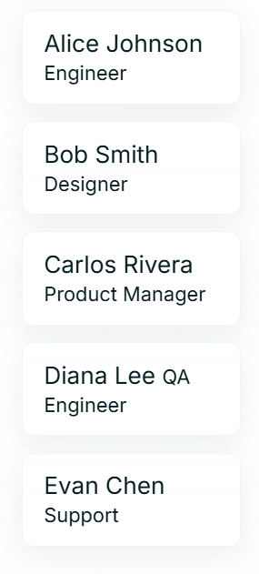
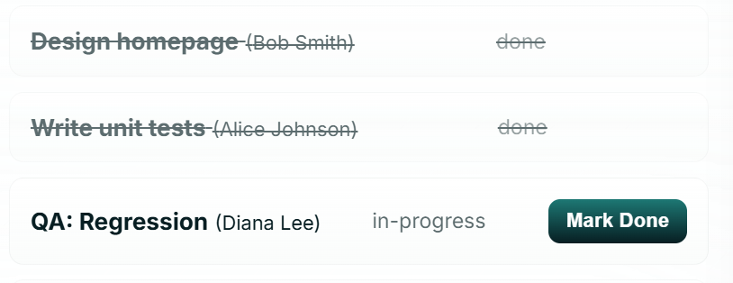
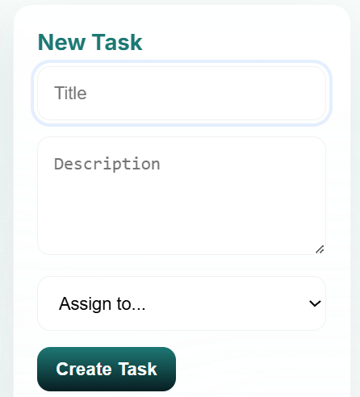

# Employee Task Manager

## Overview
The Employee Task Manager is a full-stack application designed to manage employees and their tasks. It features a React-based frontend, an Express.js backend, and MongoDB for data storage.

---
## Deployed Link 
#### [https://employee-task-manager-wine.vercel.app/](https://employee-task-manager-wine.vercel.app/)
#### [API Link](https://employee-task-manager-2un6.onrender.com)
---

## Features
- **Frontend**: React with modern styling and responsive design.
- **Backend**: RESTful API built with Express.js.
- **Database**: MongoDB for storing employees and tasks.

---

<p align="center">
  <div>Tech stack: </div>
  <a href="https://skillicons.dev">
    
  </a>
  <div>Deployment & Tools</div>
  <a href="https://skillicons.dev">
    
  </a>
</p>


## Prerequisites
Ensure you have the following installed:
- [Node.js](https://nodejs.org/) (v16 or higher)
- [MongoDB](https://www.mongodb.com/)

---

## Setup Instructions

### 1. Clone the Repository
```bash
git clone https://github.com/divija224/employee_task_manager.git
cd employee_task_manager
```

### 2. Configure Environment Variables
Create a `.env` file in the `frontend` directory with the following content:
```
VITE_API_URL=http://localhost:4000/api
```

### 3. Install Dependencies
#### Frontend:
```bash
cd frontend
npm install
```
#### Backend:
```bash
cd ../backend
npm install
```


### 4. Start the Application
1. Start the backend:
   ```bash
   cd backend
   npm start
   ```
2. Start the frontend:
   ```bash
   cd ../frontend
   npm run dev
   ```

---

## Project Structure
```
.
├── backend/                # Backend source code
│   ├── src/                # Express.js routes and models
│   ├── scripts/            # Utility scripts (e.g., seed.js)
├── database/               # Database schema and related files
├── frontend/               # Frontend source code
│   ├── src/                # React components and services
├── README.md               # Project documentation
```

---

## Usage
1. Open your browser and navigate to `http://localhost:5173` to access the frontend.
2. The backend API will be available at `http://localhost:4000/api`.

---

## API and Data Model Design

### API Endpoints

#### Employees
- **GET /api/employees**: Fetch all employees.
- **POST /api/employees**: Add a new employee.
- **GET /api/employees/:id**: Fetch a specific employee by ID.
- **PUT /api/employees/:id**: Update an employee by ID.
- **DELETE /api/employees/:id**: Delete an employee by ID.

#### Tasks
- **GET /api/tasks**: Fetch all tasks.
- **POST /api/tasks**: Add a new task.
- **GET /api/tasks/:id**: Fetch a specific task by ID.
- **PUT /api/tasks/:id**: Update a task by ID.
- **DELETE /api/tasks/:id**: Delete a task by ID.

---

### Database Schema

#### Employee
```json
{
  "_id": "ObjectId",
  "name": "string",
  "position": "string",
  "department": "string",
  "createdAt": "Date",
  "updatedAt": "Date"
}
```

#### Task
```json
{
  "_id": "ObjectId",
  "title": "string",
  "description": "string",
  "status": "string", 
  "employeeId": "ObjectId", 
  "createdAt": "Date",
  "updatedAt": "Date"
}
```
---
### Component Design
The React-based frontend is built with modular components for reusability and maintainability. Key components include:
- **Employee List**: Displays employees in a clean, centered layout.

- **Task Cards**: Show task details with status chips for quick identification.
- **Forms**: Simplified input forms for adding or updating data.


---
<!-- <div align="center"> -->





<!-- </div> -->
